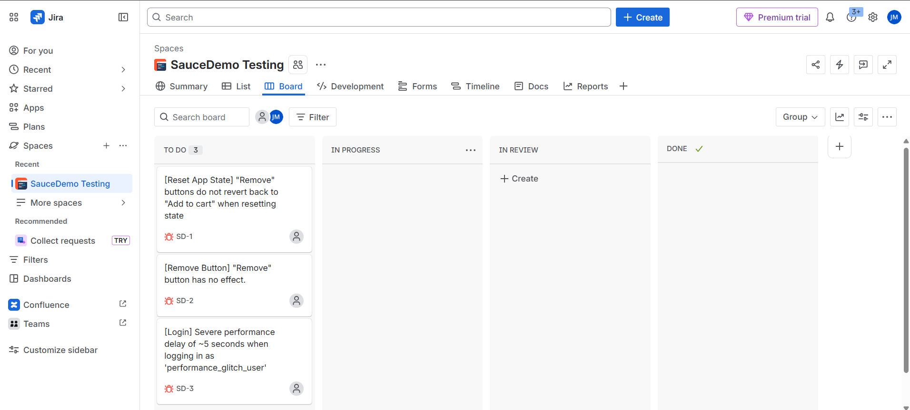

# SQA Portfolio: SauceDemo E-Commerce Testing & API Automation

This repository houses a comprehensive Software Quality Assurance (SQA) portfolio demonstrating end-to-end manual web testing, agile defect management using **Jira**, formal test summary reporting, and advanced API test automation using **Postman**.

---

## 🗺️ Project Navigation

Click the links below to explore the detailed SQA documentation and artifacts:

*   [**High-Level Test Scenarios**](./SauceDemo_Test_Scenarios.md) — The 20 "What to Test" scenarios mapped out during requirement analysis.
*   [**Detailed Test Cases**](./SauceDemo_Test_Cases.md) — 30 step-by-step test cases executed against the application.
*   [**Defect Logs & Bug Reports**](./SauceDemo_Bug_Reports.md) — 3 major functional and performance defects logged with steps to reproduce and visual proof.
*   [**JSONPlaceholder API Automation**](./JSONPlaceholder%20API%20Testing/) — Postman collection and environment files displaying automated assertion scripting and request chaining.

---

## 🛒 Project 1: SauceDemo Web Testing & Jira Integration

I executed a complete testing cycle on the SauceDemo e-commerce application to validate core workflows: user authentication, catalog sorting, cart state management, and the checkout process. 

### 📊 Test Execution Metrics
*   **Total Test Cases Planned:** 30
*   **Total Test Cases Executed:** 30
*   **Passed Test Cases:** 27
*   **Failed Test Cases:** 3
*   **Blocker/Critical Test Cases:** 0
*   **Pass Rate:** 90%
*   **Fail Rate:** 10%

### 📋 Agile Defect Tracking (Jira)
To practice real-world Agile SQA workflows, all failed test cases were logged as detailed defect tickets directly in **Jira** and tracked on an active Kanban board.

#### Repository Kanban Board

#### Logged Bug Tickets:
*   **[SD_BUG_001] [Reset App State] "Reset App State" does not revert active "Remove" buttons back to "Add to cart"**
    *   *Severity:* Medium | *Priority:* Medium
    *   [View Bug Report Details](./SauceDemo_Bug_Reports.md#bug-report-1-app-reset-state-behavior)
*   **[SD_BUG_002] [Remove Button] "Remove" button has no effect on details page for `problem_user`**
    *   *Severity:* Major | *Priority:* High
    *   [View Bug Report Details](./SauceDemo_Bug_Reports.md#bug-report-2-remove-button-failure-on-product-details-page)
*   **[SD_BUG_003] [Login] Severe performance delay of ~5 seconds when logging in as `performance_glitch_user`**
    *   *Severity:* Medium | *Priority:* High
    *   [View Bug Report Details](./SauceDemo_Bug_Reports.md#bug-report-3-severe-login-performance-delay)

### 💡 Key SQA Insights & Recommendations
*   **Business Logic Vulnerability:** The checkout system currently allows users to submit information and successfully complete a transaction with an empty cart (resulting in a $0.00 total order). It is highly recommended to implement a frontend validation check that disables the "Checkout" button when the cart is empty.
*   **Deployment Recommendation:** The standard checkout flow is functional and stable. However, the critical button failure affecting the `problem_user` and the login latency bottleneck on `performance_glitch_user` must be resolved before a final production release.

---

## 📬 Project 2: JSONPlaceholder API Test Automation

This project showcases API functional verification and request chaining using **Postman** to test CRUD operations against the JSONPlaceholder sandbox endpoints.

### ⚙️ Automation & Technical Highlights
*   **Request Chaining (Dynamic Variables):** Implemented a post-response test script on the `POST` request to automatically capture the server-generated resource `id` and save it directly into the Postman environment variables (`post_id`). This value is then passed dynamically as a parameter in downstream `PUT` and `DELETE` requests.
*   **Post-Response JavaScript Assertions:** Wrote automated scripts to instantly validate response status codes (200, 201), assert payload data integrity, check that key properties are defined, and verify array lengths are greater than 0.

### 📂 API Files
Explore the Postman collection and environment variables directly inside the [JSONPlaceholder API Testing](./JSONPlaceholder%20API%20Testing/) folder.
