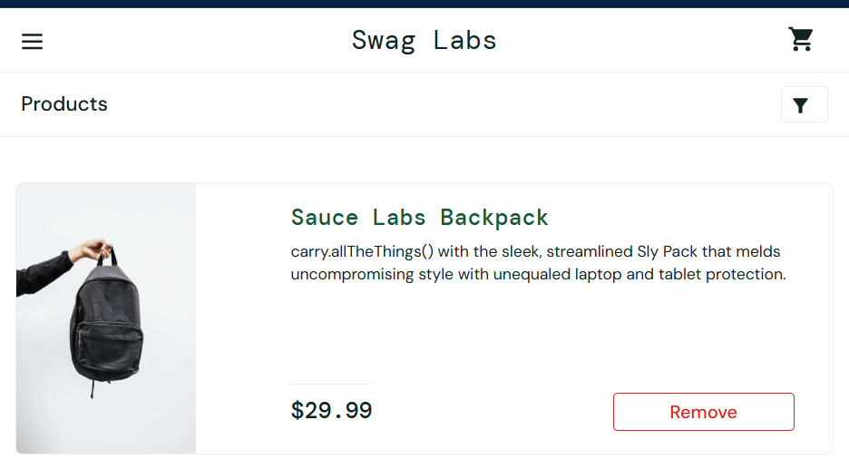
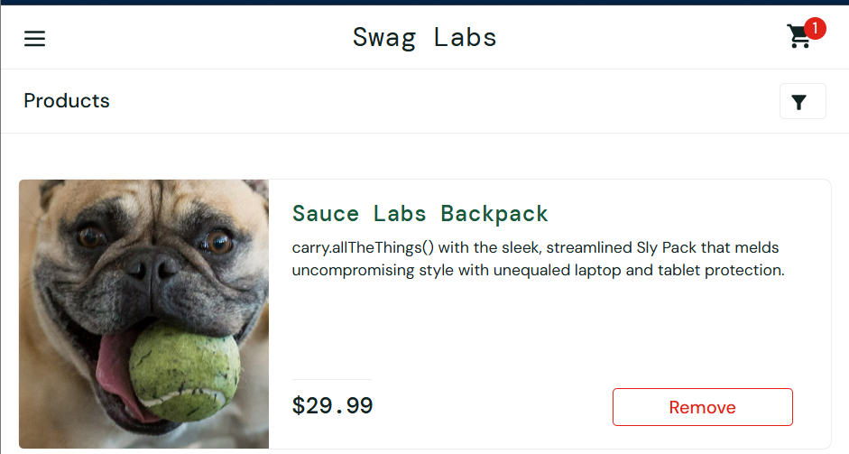
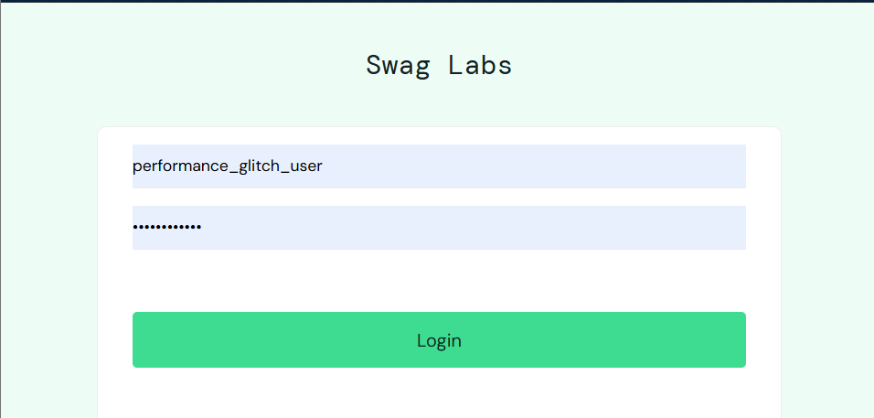

# SauceDemo Defect Logs & Bug Reports

This document contains the detailed bug reports logged during the execution of the SauceDemo test suite. These defects have also been entered into Jira for tracking.

---

## 🐛 Bug Report 1: App Reset State Behavior

*   **Bug ID:** SD_BUG_001
*   **Bug Title:** [Reset App State] "Reset App State" does not revert active "Remove" buttons back to "Add to cart"
*   **Environment:** Chrome Version 148.0.7778.168
*   **Severity:** Medium | **Priority:** Medium

### Steps to Reproduce:
1.  Log in as `standard_user`.
2.  Click the **Add to cart** button for the "Sauce Labs Backpack" product.
3.  Click the hamburger menu icon in the top-left corner to expand the sidebar.
4.  Click the **Reset App State** option in the menu.
5.  Click the **X** (close) button to close the sidebar.
6.  Observe the button state for the "Sauce Labs Backpack" product on the inventory page.

### Expected Result:
The active button for the "Sauce Labs Backpack" successfully changes from "Remove" back to "Add to cart", and the shopping cart numeric badge is cleared completely.

### Actual Result:
The shopping cart numeric badge is cleared completely, but the button for the "Sauce Labs Backpack" remains stuck as "Remove" and does not revert to "Add to cart".

### Visual Proof:

---

## 🐛 Bug Report 2: "Remove" Button Failure on Product Details Page

*   **Bug ID:** SD_BUG_002
*   **Bug Title:** [Remove Button] "Remove" button has no effect on details page for `problem_user`
*   **Environment:** Chrome Version 148.0.7778.168
*   **Severity:** Major | **Priority:** High

### Steps to Reproduce:
1.  Log in as `problem_user`.
2.  Click on the title of the "Sauce Labs Backpack" to open its details page.
3.  Click the **Add to cart** button.
4.  Click the **Remove** button that appears.

### Expected Result:
Clicking the "Remove" button successfully removes the product from the cart, reverts the button back to "Add to cart", and decrements the cart badge.

### Actual Result:
Clicking the "Remove" button has no effect; the button remains stuck as "Remove", and the item is not removed from the cart (cart badge remains at "1").

### Visual Proof:

---

## 🐛 Bug Report 3: Severe Login Performance Delay

*   **Bug ID:** SD_BUG_003
*   **Bug Title:** [Login] Severe performance delay of ~5 seconds when logging in as 'performance_glitch_user'
*   **Environment:** Chrome Version 148.0.7778.168
*   **Severity:** Medium | **Priority:** High

### Steps to Reproduce:
1.  Navigate to the SauceDemo login page.
2.  Enter `performance_glitch_user` in the Username field.
3.  Enter `secret_sauce` in the Password field.
4.  Click the **Login** button.

### Expected Result:
The system should process the authentication immediately and redirect the user to the main inventory page (`/inventory.html`) within 1.5 seconds.

### Actual Result:
There is an unacceptably long loading latency of approximately 5 seconds before the dashboard is rendered.

### Visual Proof:

